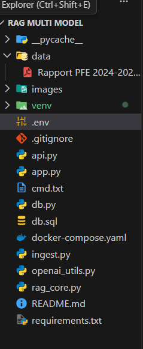
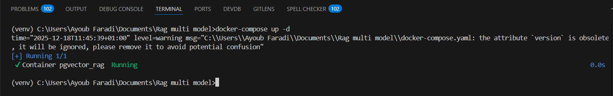
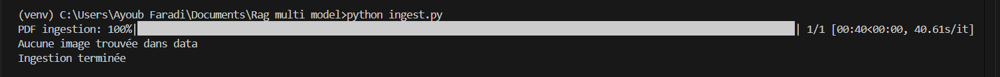
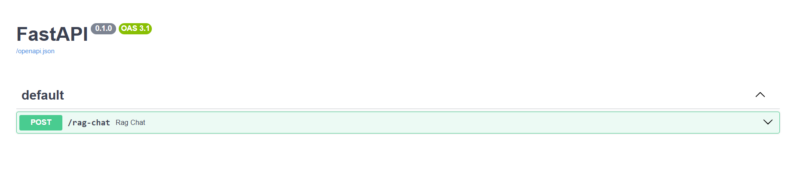
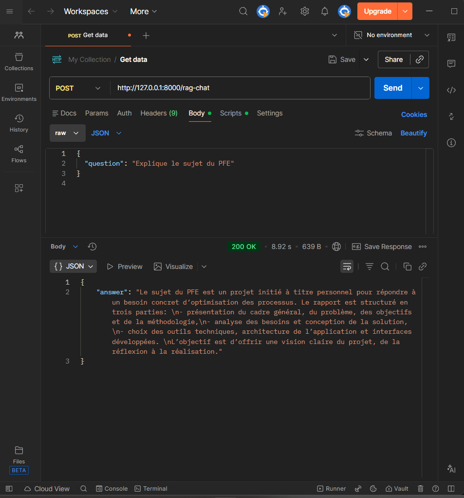
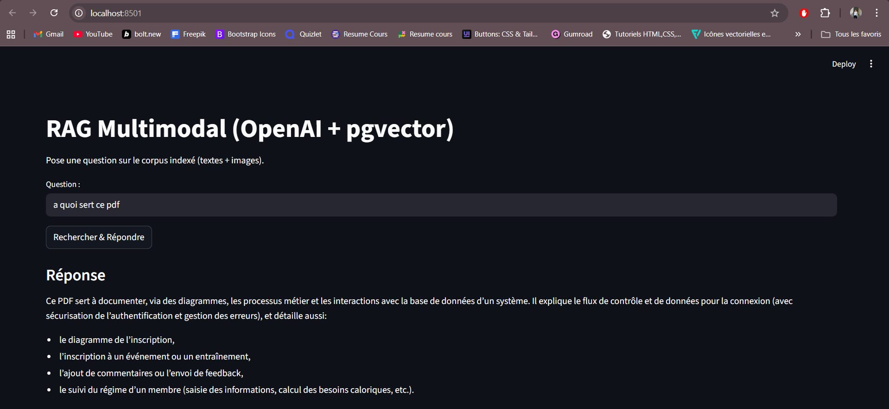
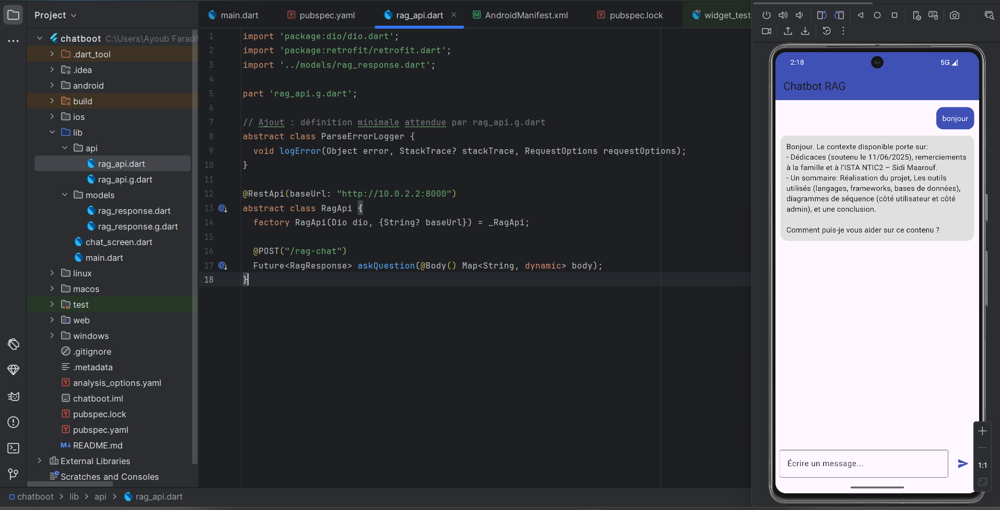

# 🚀 RAG Multimodal – OpenAI • PostgreSQL • pgvector • FastAPI • Streamlit • Flutter

Un **système RAG (Retrieval-Augmented Generation) multimodal** capable d’analyser des documents PDF, d’indexer automatiquement leur contenu (texte + images), puis de répondre intelligemment aux questions de l’utilisateur via une **API FastAPI**, une **interface Streamlit** et une **application mobile Flutter**.

---

## 🧠 Présentation du projet

Ce projet académique met en œuvre une **architecture RAG professionnelle** permettant :

* l’ingestion de documents PDF
* l’analyse multimodale (texte + captions d’images)
* le stockage vectoriel avec **pgvector**
* la recherche par similarité
* la génération de réponses contextualisées avec OpenAI

---

## Technologies utilisées

### 🔹 Intelligence Artificielle

* OpenAI (Embeddings + LLM)
* Architecture RAG

### 🔹 Backend

* Python
* FastAPI
* Uvicorn

### 🔹 Base de données

* PostgreSQL
* pgvector

### 🔹 Frontend Web

* Streamlit

### 🔹 Frontend Mobile

* Flutter
* Dart
* Dio
* Retrofit

---

## Architecture globale

```text
Flutter / Streamlit
        │
        │ HTTP POST /rag-chat
        ▼
FastAPI (RAG Backend)
        │
        │ Similarity Search (pgvector)
        ▼
PostgreSQL + pgvector
        │
        ▼
OpenAI (Embeddings + GPT)
```

---

## Structure du projet

```text
Projet
├── chat_bot/                     # Application Flutter
│   ├── lib/
│   │   ├── api/
│   │   ├── models/
│   │   ├── chat_screen.dart
│   │   └── main.dart
│   └── pubspec.yaml
│
└── RAG_MULTI_MODAL/               # Backend Python
    ├── api.py                    # API FastAPI
    ├── rag_core.py               # Pipeline RAG
    ├── ingest.py                 # Ingestion PDF
    ├── db.py                     # Connexion PostgreSQL
    ├── openai_utils.py           # Embeddings + captions
    ├── data/
    │   └── PFE.pdf
    └── docker-compose.yml        # PostgreSQL + pgvector
```

---

## ⚙️ Installation & Exécution

### 1️⃣ Lancer PostgreSQL + pgvector

```bash
docker compose up -d
```


---

### 2️⃣ Créer et activer l’environnement virtuel

```bash
python -m venv venv
venv\Scripts\activate
```

---

### 3️⃣ Installer les dépendances

```bash
pip install -r requirements.txt
```

---

## Ingestion des documents

Ajouter les fichiers PDF dans :

```text
data/
```

Puis lancer :

```bash
python ingest.py
```



✔ Les documents sont découpés en chunks
✔ Les embeddings sont générés
✔ Les données sont stockées dans pgvector


---

## 🌐 API REST (FastAPI)

### Lancer l’API

```bash
uvicorn api:app --reload
```

API disponible sur :

```
http://127.0.0.1:8000/docs
```


---

### Exemple de requête POST

```json
{
  "question": "Explique le sujet du PFE",
}
```


---

## 🧠 Interface Web (Streamlit)

Lancer l’interface :

```bash
streamlit run app.py
```

Fonctionnalités :

* Champ de question
* Réponse générée par le RAG
* Affichage du contexte récupéré


---

## 🤖 Application Mobile Flutter

### Lancer l’application

```bash
flutter run
```

Fonctionnalités :

* Interface chat moderne
* Envoi des questions vers FastAPI
* Réponses basées uniquement sur le PDF indexé


---

## Fonctionnement du pipeline RAG

1. Le PDF est découpé en chunks
2. Chaque chunk est transformé en embedding
3. Les embeddings sont stockés dans PostgreSQL (pgvector)
4. Lors d’une question :

   * Recherche des chunks les plus proches
   * Construction du contexte
   * Génération de la réponse avec OpenAI
5. La réponse est renvoyée au frontend

---

## Extensions / Améliorations possibles

- Ajouter une pagination et métadonnées sur les documents (title, author, page)
- Supporter davantage de formats (DOCX, HTML) et extensible pour captions multi-modal
- Evaluation automatique des réponses (QA dataset) et tests de robustesse
- Authentification / quotas pour l'API
- Index et recherche côté client + visualisation de similarité

---

## Authors & Contributions

- Auteur principal: Ayoub Faradi (présent dans l'arborescence)
- Contributions: PR, issues, suggestions sont les bienvenues

---

## Licence

Aucune licence définie dans le dépôt — ajoutez un fichier `LICENSE` si vous souhaitez en définir une (MIT, Apache, etc.).

---

Si vous voulez que j'ajoute un exemple `Makefile`, `Dockerfile` pour déployer l'app, un script d'init DB automatisé, ou un guide windows/mac/linux étape par étape, dites-le et je l'ajoute ✅
